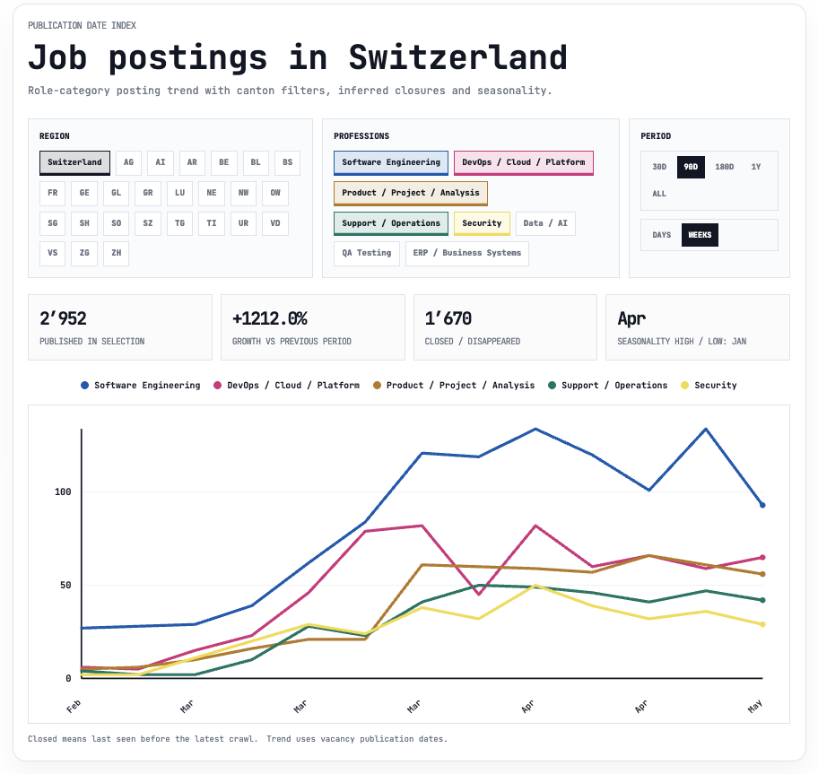

# Swiss IT Jobs Analytics

[English](../../README.md) | [Deutsch](README.de.md) | [Français](README.fr.md) | [Italiano](README.it.md)

Swiss IT Jobs Analytics est un outil qui analyse des milliers d'offres d'emploi sur le marché suisse afin d'identifier les compétences, technologies et parcours professionnels les plus demandés. Il vous aide à comprendre quoi apprendre aujourd'hui pour rester compétitif demain.

Voir le site maintenant - https://vivalabit.github.io/swiss-it-jobs-analytics/

Sources actuelles :

- `LinkedIn`
- `jobs.ch`
- `jobscout24.ch`
- `jobup.ch`
- `swissdevjobs.ch`

Le jeu de données est dédupliqué entre les sources au niveau de l'offre.
Lorsqu'une même offre est publiée sur plusieurs plateformes d'emploi, elle n'est comptabilisée qu'une seule fois dans les statistiques publiques.

Le projet est encore en cours de développement, les statistiques et la structure peuvent donc évoluer.

Le site public publie des instantanés agrégés du marché suisse de l'emploi IT, construits à partir de jeux de données d'offres traitées provenant de plusieurs plateformes. Il met en évidence des signaux généraux tels que le volume d'offres, l'activité des employeurs, la demande de compétences, les fourchettes salariales, la concentration géographique, la répartition par niveau de séniorité et la distribution des modes de travail.

## Ce que couvre ce projet

Ce projet vise à répondre à des questions pratiques et fondées sur les données concernant le marché de l'emploi :

- Quels rôles sont actuellement les plus demandés
- Quelles compétences et technologies apparaissent le plus fréquemment
- Quels cantons et quelles villes concentrent le plus d'offres d'emploi
- Comment la demande se répartit entre les niveaux de séniorité
- Comment les fourchettes salariales comparables diffèrent selon les catégories de rôles
- Quelles compétences sont réellement valorisées par les employeurs

**Les statistiques couvrent les offres publiées à partir de 2026.**

***Les agences de placement sont exclues.***

## Méthodologie

Nous collectons les offres d'emploi depuis plusieurs sources (LinkedIn, jobs.ch, jobscout24.ch, jobup.ch, swissdevjobs.ch), les stockons dans des bases de données locales propres à chaque fournisseur, puis les faisons correspondre à un schéma commun et générons des statistiques agrégées à partir du jeu de données combiné. Durant la phase de consolidation, nous utilisons une déduplication fondée sur l'identité de l'offre au sein de chaque source afin d'éviter que les importations en double ne gonflent les statistiques.

Ensuite, chaque offre d'emploi est normalisée : l'entreprise, le lieu, le canton, la séniorité, le mode de travail et les champs de salaire sont standardisés, tandis que la catégorie du rôle, les compétences, les langages de programmation, les frameworks/bibliothèques et d'autres attributs analytiques sont extraits du texte et des champs structurés. Les salaires, lorsqu'ils sont disponibles, sont convertis en un format annuel comparable en CHF afin de calculer des synthèses et des répartitions par rôle et par niveau de séniorité.

Après cela, les agences et intermédiaires de recrutement sont exclus de l'échantillon global. C'est important : dans nos statistiques publiques, nous cherchons à suivre spécifiquement le marché direct de l'emploi, plutôt que l'activité d'intermédiaires qui peuvent republier plusieurs fois des postes similaires et déformer l'image de la demande. Les exclusions s'appuient sur une liste normalisée d'entreprises de placement/recrutement connues et de leurs alias.

Les offres d'emploi sont également analysées à l'aide de l'IA : les filtres logiciels standards ne parviennent souvent pas à reconnaître toutes les informations pertinentes et peuvent négliger des détails importants. L'IA ne remplace pas ces filtres et n'invente pas de données, mais travaille avec eux pour fournir une analyse plus approfondie et plus précise.

[Technical usage](local/docs/TECHNICAL_USAGE.md) 
[Local App](local/docs/LOCAL_APP.md)
